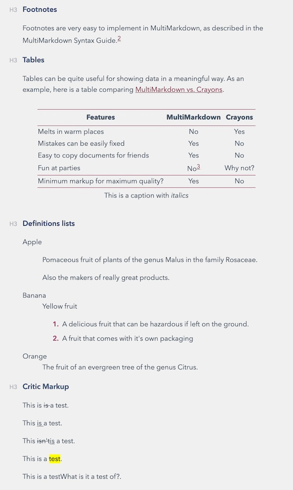

# Markdown Niceties

[Example Rendering](multimarkdown-example.html)

## gandalf.css

A port of Bear.app's Gandalf theme to some generic CSS for styling Markdown in
Typora and DEVONthink. To use, copy or symlink to:

* Typora: `~/Library/Application Support/abnerworks.Typora/themes`
* DEVONthink: `~/Library/Application Support/DEVONthink 3/StyleSheets`

This stylesheet can handle some of the more complex document structures created by MultiMarkdown like a table of contents, fancy tables, snippets, and footnotes that Bear itself doesn't handle. I've added all of the colors for Gandalf even though most aren't being used for anything, but you can at least experiment and see if the colors are useful for your own customizations :)